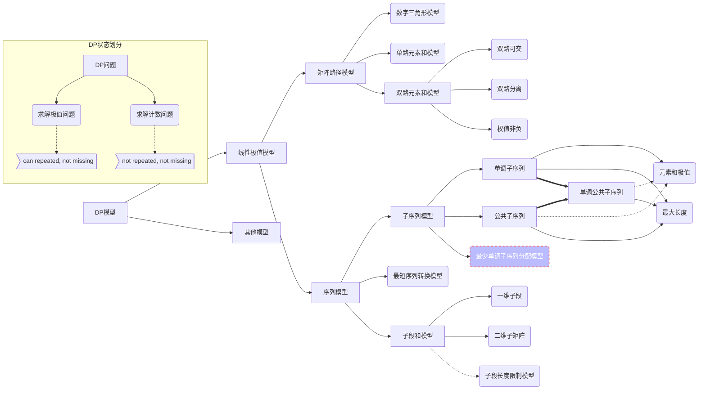

---
title:			动态规划入门之线性极值模型
description:	'动态规划专题系列一'

author: mooyyu
contrib:
category: [ algorithm, al-DP ]
date: 2020-03-25
---

**动态规划问题的本质：无环最短路问题**

## 动态规划问题分析模型

>   **DRSO**: difinition––request––state trasition––optimization
>
>   一般一个完整DP问题的分析可以经历这4个步骤，依据前3个阶段可以写出基础代码。再根据递推的基础代码判断是否可以做一些等价转换（即优化），若有可以优化的地方，则需优化得到最后的解法；若没有可以优化的地方，则该DP模型的分析只有前3个阶段。
>
>   一般DP问题有递推和记忆化搜索两种编码方式，有优化的DP模型一般不可以使用记忆化搜索解决。



## 线性极值DP模型

### 矩阵路径极值DP模型

**矩阵路径DP模型是指：在矩阵中求解从源点至汇点（走法不回头，即无环）的路径权值的极值**

#### 数字三角形模型

**数字三角形，从顶部出发，在每一结点可以选择移动至其左下方的结点或移动至其右下方的结点，一直走到底层，要求找出一条路径，使路径上的数字的和最大或最小。**

$$
\begin{aligned}
REQ&\\
&M\{ f(N, i)\mid 1\leqslant i\leqslant N \}\\
STTR&\\
&f(x, y) = ar(x, y) + \begin{array}{c|c}\hline 
x = 1 & x > 1 \\\hline 
0 & \begin{array}{c|c}
y = 1 & f(x - 1, y) \\\hline 
1 < y < x & M\{ f(x - 1, y), f(x - 1, y) \} \\\hline 
y = x & f(x - 1, y - 1) \\
\end{array}\\
\hline\end{array}\\
\end{aligned}
$$

#### 单路矩阵模型

**带权矩阵，从一顶点出发到达其对角，步数为两点的曼哈顿距离，要求找出一条路景，使路径上的权值之和最大或最小。**

$$
\begin{aligned}
STTR&\\
&f(x, y) = ar(x, y) + \begin{array}{r|c|c}\hline 
& x = 1 & x > 1 \\\hline 
y = 1 & 0 & f(x - 1, y) \\\hline 
y > 1 & f(x, y - 1) & M\{ f(x - 1, y), f(x, y - 1) \} \\
\hline \end{array}
\end{aligned}
$$

#### 双路矩阵模型

**基础模型：带权矩阵，从一顶点出发通过两条路径分别到达其对角，各路径均满足步数为两点的曼哈顿距离，要求两路径上的权值之和最大或最小。(各节点权值只能被一条路径所用, 另一条路径上权值该节点权值变为0) 分析以最大为例**

$$
\begin{aligned}
DIF&\\
&f(k, a, b)\text{ express the value of two paths respectively ending at (a, k - a) and (b, k - b)}\\
REQ&\\
&f(n + m, n, n)\\
STTR&\\
&f(k, a, b) = \begin{array}{c|c}\hline 
a < b & a\geqslant b \\\hline 
f(k, b, a) & 
\begin{array}{c|c}
a - b= 0 & a - b > 0 \\\hline 
\begin{matrix} ar(a, k - a)\\ +\\
\overbrace{\underbrace{ \begin{matrix}
f(k - 1, a, b),\\f(k - 1, a - 1, b - 1),\\f(k - 1, a, b - 1)
\end{matrix} }}^{\max}
\end{matrix} & 
\begin{matrix} ar(a, k - a)\\ +\\ ar(b, k - b)\\ +\\
\overbrace{\underbrace{ \begin{matrix}
f(k - 1, a, b),\\f(k - 1, a - 1, b - 1),\\f(k - 1, a, b - 1),\\f(k - 1, a - 1, b)
\end{matrix} }}^{\max}
\end{matrix}
\end{array}\\
\hline\end{array}\\
&\natural\quad specially,\ f(k, a, 0) = f(k, k, b) = -\inf,\ a\geqslant b
\end{aligned}
$$

**特化模型1：在基础模型之上要求除起点与终点外任意一点至多属于一条路径**

**特化模型2：在基础模型之上矩阵保证各点权值非负（模型2一定满足模型1的条件）**

$$
\begin{aligned}
REQ&\\
&f(n + m - 1, n, n - 1) + ar(n, m) + ar(1, 1)\\
STTR&\\
&f(k, a, b) = \begin{array}{c|c}\hline 
a < b & a > b \\\hline 
f(k, b, a) & 
    \begin{matrix} ar(a, k - a)\\ +\\ ar(b, k - b)\\ +\\
        \begin{array}{c|c}
            a - b = 1 & a - b > 1 \\\hline 
            \overbrace{\underbrace{ \begin{matrix}
            f(k - 1, a, b),\\f(k - 1, a - 1, b - 1),\\f(k - 1, a, b - 1)
            \end{matrix} }}^{\max} & \overbrace{\underbrace{ \begin{matrix}
            f(k - 1, a, b),\\f(k - 1, a - 1, b - 1),\\f(k - 1, a, b - 1),\\f(k - 1, a - 1, b)
            \end{matrix} }}^{\max}
        \end{array}\\
    \end{matrix}\\
\hline \end{array}\\
&\natural\quad initially,\ f(k, a, 0) = f(k, k, b) = \begin{cases}
-\inf,&\text{for model 1}\\
0,&\text{for model 2}
\end{cases},\ a\geqslant b\\
&\hphantom{\natural\quad initially, } \ f(3, 2, 1) = ar(1, 2) + ar(2, 1)
\end{aligned}
$$

### 序列极值DP模型

#### 单调子序列

##### 单调子序列元素和模型

**求解单调子序列的最大或最小元素和，分析以最大元素和为例**

$$
\begin{aligned}
DIF&\\
&f(x)\text{ express the largest sum of elements}\\
&\hphantom{f(x) express}\hookrightarrow\text{of a monotonic subsequence ending in ar(x)}\\
REQ&\\
&\max\{ f(x)\mid 1\leqslant x\leqslant N \}\\
STTR&\\
&f(x) =  ar(x) + \max\{f(i)\mid i < x, ar(i) < ar(x) \}\\
&\natural\quad specially,\ \max\emptyset = 0
\end{aligned}
$$

##### 最长单调子序列长度模型

**求解最长单调上升或下降子序列的长度，分析以严格单调上升为例**

**具体到问题通常有上/下坡模型和单峰/谷模型**

$$
\begin{aligned}
DIF&\\
&f(x)\text{ express the length of the longest monotonic subsequence}\\
&\hphantom{f(x) express}\hookrightarrow\text{of the last element at the x position}\\
REQ&\\
&\max\{ f(x)\mid 1 \leqslant x\leqslant N \}\\
STTR&\\
&f(x) = 1 + \max\{ f(i)\mid i < x, ar(i) < ar(x) \}\\
&\natural\quad specially,\ \max\emptyset = 0
\end{aligned}
$$

> OPT

*注：该优化并非建立在基础状态转移方程之上，所以严格来说不属于DP*

对于一个给定的序列，我们假设有这样一个维护数组，数组第$$i$$个元素存储该序列的长度为$$i$$的严格单调上升子序列的尾元素的值，易知这样的数组有两个性质：

-   数组的大小为该维护序列的最长严格单调上升子序列的长度
-   数组中的元素的值是严格单调上升的


**使用归纳法进行分析**

显然，对于只有一个元素的序列，其维护数组中也仅有这个元素。

现在需要在给定序列的末尾添加一个元素，那么更新维护数组就有两种情况

1.  如图中$$k1$$所示，新增元素的值不大于现有数组中第一个元素，那么它将成为新序列的长度为1的严格单调上升子序列的尾元素，即$$k1$$将更新数组中第一个元素。

2.  如图中$$k2$$所示，新增元素的值比现有数组中第一个元素要大，那么一定可以找到数组中小于$$k2$$的最大元素$$j$$，由于数组是单调的，可以使用二分查找。

    那么新增元素将与$$j$$所在子序列构$$v$$成比$$v$$长度大1的新的严格单调上升子序列，即$$k2$$将更新数组中第$$j + 1$$个元素。明显的，若找到的元素为现有数组中最后一个元素，则数组的大小将加1。

如此，对于在末尾添加新元素的序列便可以更新对应的维护数组。

```cpp
int rfind(int l, int r, int val) {
	static int mid;
	if (l == r - 1) return l;
	mid = (l + r + 1) >> 1u;
	if (ex[mid] < val) return rfind(mid, r, val);
	else return rfind(l, mid, val);
}
int solve() {
	int len = 1;
	ex[1] = ar[1];
	for (int i = 2, pos; i <= n; i++) {
		if (ex[1] < ar[i]) {
			pos = rfind(1, len + 1, ar[i]) + 1;
			len = max(len, pos);
			ex[pos] = ar[i];
		} else ex[1] = ar[i];
	}
	return len;
}
```

也可以分为「比最后一个元素还大」和「寻找不小于新元素的最小元素」两种情况，同理。

```cpp
int lfind(int l, int r, int val) {
	static int mid;
	if (l == r - 1) return l;
	mid = (l + r - 1) >> 1u;
	if (val <= ex[mid]) return lfind(l, mid + 1, val);
	else return lfind(mid + 1, r, val);
}
int solve() {
	int len = 1;
	ex[1] = ar[1];
	for (int i = 2, pos; i <= n; i++) {
		if (ar[i] <= ex[len]) {
			pos = lfind(1, len + 1, ar[i]);
			ex[pos] = ar[i];
		} else ex[++len] = ar[i];
	}
	return len;
}
```

上面两份代码中$$lfind$$和$$rfind$$是二分查找[^b_find]的两种模式。

##### 最少单调子序列分配模型

**通常求解将一个序列中的元素不重不漏的分配到最少的单调子序列中去，分析以非严格单下降为例**

*该模型严格来说不属于DP问题，但是其思想和优化的最长单调子序列思想一致，故放到这里*

对于一个给定的序列，我们假设有这样一个维护数组，数组第$$i$$个元素存储该序列分配的第$$i$$​个非严格单调下降子序列的尾元素的值，由于期望分配的子序列个数最少，当序列末尾新增元素需要分配时，有两个显然的原则：

1.  能不新增子序列就不新增，即尽量将新元素加在已有序列的后面
2.  若将新增元素加载已有序列的后面，则尽量使添加后各序列的尾元素都尽量大

易知这样的数组有两个性质：

-   数组的大小为该维护序列的最少非严格单调下降子序列个数
-   数组中的元素的值是严格单调上升的


**使用归纳法进行分析**

显然，对于只有一个元素的序列，其维护数组中也仅有这个元素。

现在需要在给定序列的末尾添加一个元素，那么更新维护数组就有两种情况

1.  如图中$$k1$$所示，新增元素的值不大于现有数组中最后一个元素，那么一定可以找到数组中不小于$$k1$$的最小元素$$j$$，由于数组是单调的，可以使用二分查找。

    那么新增元素将放在$$j$$所在子序列的最后，即$$k1$$将更新数组中第$$j$$个元素。

2.  如图中$$k2$$所示，新增元素的值比现有数组中最后一个元素还大，那么它将放到新增的一个子序列中去，即$$k2$$将成为数组中新增的一个元素。

如此，对于在末尾添加新元素的序列便可以更新对应的维护数组。

```cpp
int lfind(int l, int r, int val) {
	static int mid;
	if (l == r - 1) return l;
	mid = (l + r - 1) >> 1u;
	if (ex[mid] >= val) return lfind(l, mid + 1, val);
	else return lfind(mid + 1, r, val);
}
int solve() {
	int cnt = 1;
	ex[1] = ar[1];
	for (int i = 2, pos; i <= n; i++) {
		if (ex[cnt] >= ar[i]) {
			pos = lfind(1, cnt + 1, ar[i]);
			ex[pos] = ar[i];
		} else ex[++cnt] = ar[i];
	}
	return cnt;
}
```

也可以分为「不大于第一个元素」和「寻找小于新元素的最大元素」两种情况，同理。

```cpp
int rfind(int l, int r, int val) {
	static int mid;
	if (l == r - 1) return l;
	mid = (l + r + 1) >> 1u;
	if (ex[mid] < val) return rfind(mid, r, val);
	else return rfind(l, mid, val);
}
int solve() {
	int cnt = 1;
	ex[1] = ar[1];
	for (int i = 2, pos; i <= n; i++) {
		if (ex[1] < ar[i]) {
			pos = rfind(1, cnt + 1, ar[i]) + 1;
			cnt = max(cnt, pos);
			ex[pos] = ar[i];
		} else ex[1] = ar[i];
	}
	return cnt;
}
```

##### 最长长度与最少分配的关系

容易发现这两个模型的贪心思路与代码实现本质上是一样的，这就说明这两个问题模型实际上用的是一种算法模型求解的。换言之，这两个问题模型是可以互相转换的。我们设一种单调性为$$\lambda$$,则对于一个确定的序列，有如下性质:
$$
满足\lambda的最长子序列的长度 = 满足\lnot\lambda的最少子序列的分配个数
$$

#### 公共子序列

##### 公共子序列元素和模型\*

（待补充）

##### 最长公共子序列模型

**通常求解两个子序列的最长公共子序列**

$$
\begin{aligned}
DIF&\\
&the\ two\ sequences\ are\ respectively\ expressed\ by\ a, b\\
&f(i, j)\text{ express the length of the longest common subsequence}\\
&\hphantom{f(i, j) express}\hookrightarrow\text{of the sequence of the first i elements of sequence a}\\
&\hphantom{f(i, j) express}\hookrightarrow\text{and the sequence of the first j elements of sequence b}\\
STTR&\\
&state\ division: a(i), b(j)\ respectively\ in\ the\ common\ subsequence\ or\ not\\
&\hphantom{state\ division: }\begin{vmatrix}\!\!\begin{array}{r|cc}
\hline  & a(i)\ is\ in & a(i)\ is\ not\ in \\
\hline b(j)\ is\ in  &  \mathit{11}  &  \mathit{01}  \\
b(j)\ is\ not\ in  & \mathit{10} &  \mathit{00}\\
\hline \end{array}\!\!\end{vmatrix}\\
&state\ expression: \begin{array}{c|c}\hline 
f(i, j - 1) & \mathit{00}\cup\mathit{10} \\\hline 
f(i - 1, j) & \mathit{00}\cup\mathit{01} \\\hline 
f(i - 1, j - 1) + 1 & \mathit{11} \\
\hline\end{array}\\
&f(i, j) = \begin{array}{r|l}\hline 
a(i) = b(j) & \max\{ f(i, j - 1), f(i - 1, j), f(i - 1, j - 1) + 1 \} \\\hline 
a(i)\not = b(j) & \max\{ f(i, j - 1), f(i - 1, j) \} \\
\hline\end{array}\\
&\natural\quad specially,\ f(i, 0) = f(0, j) = 0
\end{aligned}
$$

>   经典应用

-   对于一个给定的字符串，最少需要添加几个字符，才能变成回文串。

#### 单调公共子序列

##### 单调公共子序列元素和模型\*

（待补充）

##### 最长单调公共子序列模型

**分析以最长单调上升公共子序列为例**

$$
\begin{aligned}
DIF&\\
&f(i, j)\text{ express the longest monotonic common subsequence}\\
&\hphantom{f(i, j) express\quad}\hookrightarrow\text{of the sequence of the first i elements of sequence a}\\
&\hphantom{f(i, j) express\quad}\hookrightarrow\text{and the sequence of the first j elements of sequence b}\\
&\hphantom{f(i, j) express}\hookrightarrow\text{ending in b(j)}\\
REQ&\\
&\max\{ a.legnth, i)\mid 1\leqslant i\leqslant b.length \}\\
STTR&\\
&state\ division: \text{a(i) is not contained or behind element b(k)}\\
&f(i, j) = \begin{array}{r|c}\hline 
a(i) \not= b(j) & f(i - 1, j) \\\hline 
a(i) = b(j) & \max\begin{Bmatrix}
f(i - 1, j),\\
1 + \max\{ f(i - 1, k)\mid 1\leqslant k < j, b(k) < b(j) \}\\
\end{Bmatrix} \\
\hline\end{array}\\
&\natural\quad specially,\ \max\emptyset = 0, f(0, j) = 0
\end{aligned}
$$
*朴素递推代码*

```cpp
for (int j = 1; j <= m; j++) {	// It doesn't matter if the first loop is n or m
    cnt[0][j] = 0;	// initialization of the global variable is 0
    for (int i = 1; i <= n; i++) {
        cnt[i][j] = cnt[i - 1][j];
        if (a[i] == b[j]) {
            cnt[i][j] = max(cnt[i][j], 1);
            for (int k = 1; k < j; k++)
                if (b[k] < b[j])	// b[j] equals with a[i]
                    cnt[i][j] = max(cnt[i][j], cnt[i - 1][k] + 1);
        }
    }
}
```

> OPT

```cpp
for (int i = 1, j, maxv; i <= n; i++) {	// n must be the outermost loop
    for (maxv = j = 1; j <= m; j++) {
        cnt[i][j] = cnt[i - 1][j];
        if (a[i] == b[j]) cnt[i][j] = max(cnt[i][j], maxv);
        else if (a[i] > b[j]) maxv = max(maxv, cnt[i - 1][j] + 1);
    }
}
```

#### 最短序列转换模型

**通常给出初始序列与目标序列，给定几种转换方式，求解最少转换次数，分析需要具体问题具体分析**

-   最短编辑距离

    给定两个字符串A和B，现在要将A经过若干操作变为B，可进行的操作有：

    1.  删除–将字符串A中的某个字符删除。
    2.  插入–在字符串A的某个位置插入某个字符。
    3.  替换–将字符串A中的某个字符替换为另一个字符。

    现在请你求出，将A变为B至少需要进行多少次操作。

$$
\begin{aligned}
DIF&\\
&f(i, j)\text{ express the shortest conversation step}\\
&\hphantom{f(i, j) express}\hookrightarrow\text{from the sequence of the first i elements of A}\\
&\hphantom{f(i, j) express}\hookrightarrow\text{to the sequence of the first j elements of B}\\
STTR&\\
&\natural\quad state\ division: \text{tail element performed which operation or not}\\
&f(i, j) = \min\begin{array}{r|c}\hline 
A(i) = B(j) & \min\{ f(i - 1, j) + 1, f(i, j - 1) + 1, f(i - 1, j - 1) \} \\\hline 
A(i) \not= B(j) & 1 + \min\{ f(i - 1, j), f(i, j - 1), f(i - 1, j - 1) \} \\
\hline\end{array}\\
&\natural\quad specially,\ f(i, 0) = i, f(0, j) = j
\end{aligned}
$$

#### 子段和模型

**通常求解元素和最大或最小的子段**

##### 一维子段模型

$$
\begin{aligned}
DIF&\\
&f(x)\text{ express the extre sum of elements}\\
&\hphantom{f(x) express}\hookrightarrow\text{of a subsection ending in ar(x)}\\
REQ&\\
&M\{ f(x)\mid 1\leqslant x\leqslant N \}\\
STTR&\\
&f(x) = ar(x) + M\{0, f(x - 1)\}\\
&\natural\quad specially,\ f(1) = ar(1)
\end{aligned}
$$

##### 二维子矩阵模型

$$
\begin{aligned}
DIF&\\
&f(i, j, x)\text{ express extre sum of elements of the matrix}\\
&\hphantom{f(i, j, x) express}\hookrightarrow\text{with x columns as the last column}\\
&\hphantom{f(i, j, x) express}\hookrightarrow\text{containing i ~ j rows}\\
REQ&\\
&M\{ f(i, j, x)\mid 1\leqslant i\leqslant j\leqslant N, 1\leqslant x\leqslant M \}\\
STTR&\\
&f(i, j, x) = \sum_{row = i}^j ar(row, x) + M\{ 0, f(i, j, x - 1) \}\\
&\natural\quad specially,\ f(i, j, 1) = \sum_{row = i}^j ar(row, 1)
\end{aligned}
$$

> OPT

二维的核心思想是一致的，通过降维转换为一维模型

```cpp
ret = INF;
for (int i = 1; i <= n; i++) {
    fill(ex + 1, ex + m + 1, 0LL);
    for (int j = i; j <= n && j < i + n; j++) {
        static llong sum;
        sum = 0LL;
        for (int k = 1; k <= m; k++) {
            ex[k] += ar[j][k];
            sum += ex[k];
        }
        ret = max(ret, ans[1] = ex[1]);
        for (int k = 2; k <= m; k++) {
            ans[k] = ex[k];
            ret = max(ret, ans[k] += max(0LL, ans[k - 1]));
        }
    }
}
```

>   经典题目

-   有一个神奇的环状矩阵，它的第一行与最后一行相连，第一列与最后一列相连。求这个矩阵的最大非空子矩阵和是多大，规定矩阵每个位置元素最多出现一次。

    **一般对于环状问题都可以转换为两倍长度+一倍限制。本题在累积方向可以这么做，但在DP方向不可以，因为有限制的情况下不满足最优子结构（或使用长度限制模型），这里给出更简单的方法**

$$
\begin{aligned}
DIF&\\
    &\begin{aligned}
    f(i, j, x) &= \sum_{row = i}^j ar(row, x) + \max\{ 0, f(i, j, x - 1) \},\\
    &\quad\natural\quad specially,\ f(i, j, 1)  =\sum_{row = i}^j ar(row, 1)\\
    g(i, j, x) &= \sum_{row = i}^j ar(row, x) + \min\{ 0, g(i, j, x - 1) \},\\
    &\quad\natural\quad specially,\ g(i, j, 1)  =\sum_{row = i}^j ar(row, 1)\\
    F(i, j) &= \max\{ f(i, j, x)\mid 1\leqslant x\leqslant M \}\\
    G(i, j) &= \min\{ g(i, j, x)\mid 1\leqslant x\leqslant M \}\\
    \mathbb{SUM}(i, j) &= \sum_{row = i}^j\sum_{col = 1}^M ar(row, col)\\
    \end{aligned}\\
    REQ&\\
    &\max\{ FF(i, j)\mid 1\leqslant i\leqslant j\leqslant N\}\\
    \\STTR&\\
    &FF(i, j) = \begin{array}{r|c}\hline 
    G(i, j) = \mathbb{SUM}(i, j) & F(i, j) \\\hline 
    G(i, j) \not= \mathbb{SUM}(i, j) & \max\{ F(i, j), \mathbb{SUM} - G(i, j) \} \\
    \hline\end{array}
    \end{aligned}
$$

##### 子段长度限制模型\*

(待补充)

[^b_find]: 对于可被某性质划分为两段「一段为满足该性质的序列（非空），另一段为不满足该性质的序列」的序列（非空），查找「临界满足该性质的」的元素的方法，有两种模式。后续会在本博客专题文章中详细说明。
