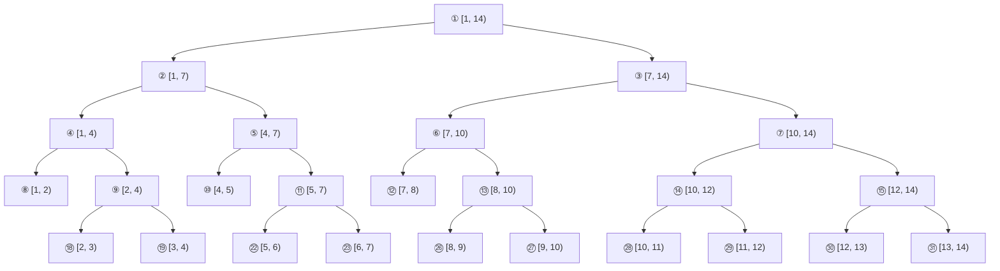

---
title:			算法竞赛简单数据结构(一)
description:	'数据结构系列专题一'

author: mooyyu
contrib:
category: [ algorithm, al-DS ]
date: 2020-03-30
---


## 本文主要内容

-   基础数据结构
    -   链式前向星
    -   单调队列
    -   单调栈
    -   维护插入时间戳的堆
-   高级数据结构
    -   并查集
    -   字典树
    -   Spare Table
    -   树状数组
    -   线段树

## 基础数据结构

**STL**中对各数据结构的支持还是很好的，但有些时候我们希望在基础数据结构上维护一些额外信息或追求速度则需要使用数组模拟和维护。

### 链式前向星

链表的实现方式一般有「STL中的list」、「结构体+指针的动态模拟」、「向量vector」和「链式前向星」。而其中list难以维护额外数据，动态模拟与向量内存操作次数过多增加耗时，而链式前向星则很好的解决了这些问题。

先来直观地了解一下链式前向星的存储，假设现在仅存储了两条链$$a, b$$，且在存储过程中删除了一个元素，最终$$a, b$$各有5个元素。则整体结构类似于下图。


可以发现链式前向星的一些重要特征：

-   由两部分组成：头结点数组和元素数组。并且对于每一条链，头结点连接最后一个元素。
-   被删除的元素其占用的内存不被释放。

-   这样存储结构本身就维护了一个额外信息：某个元素(包括已被删除的)在整体操作过程中是第几个被插入的。

下面给出具体实现

```cpp
template< class type >
class starlist {
	int idx = 1;
public:
	struct { type val; int ptr; } ar[maxn + 1] {};
	void insert(int pos, type val) {
		ar[idx] = {val, ar[pos].ptr};
		ar[pos].ptr = idx++;
	}
	void erase(int pos) {
		ar[pos].ptr = ar[ar[pos].ptr].ptr;
	}
};
```

### 单调队列

单调队列比较复杂，但很重要，很多问题的优化需要用到。**与普通队列不同的是，单调队列并不直接维护元素本身，而是把元素存储在固定的序列中，单调队列维护其下标——因为入队的元素数量与单调队列中实际元素数量不一定相等。**

单调队列在插入元素时通过排出尾部「不满足单调性质的元素」来保证单调。下面以严格单调递增示例插入操作。


```cpp
//	用val这个数组表示固有序列
template< class Comp >
class monoque {
	int ar[maxn] {};
	int head = 0, end = 0;
	Comp cmp;
public:
	int front() { return ar[head]; }
    int back() { return ar[end - 1]; }
	void pop() { ++head; }
	bool empty() { return head == end; }
	int len() { return back() - front() + 1; }	// 返回入队元素数量
	int push(int x) {	// 插入在固有序列中的下标
		while (!empty() && !cmp(val[back()], val[x])) --end;
		ar[end++] = x;
		return val[front()];
	}
};
```

### 单调栈

单调栈比较好理解，实现起来也很直观。下面是单调栈的简单实现。

```cpp
template< class type, class Comp >
class monostack {
	type ar[maxn + 1] {};
	int pos = 0;
	Comp cmp;
public:
	type push(type x) {
		while (!empty() && !cmp(top(), x)) pop();
		ar[++pos] = x;
		return pos == 1 ? -1 : ar[pos - 1];
	}
	bool empty() { return !pos; }
	type top() { return ar[pos]; }
	void pop() { --pos; }
};
```

### 维护插入时间戳的堆

**STL**对堆得支持比较全，比如算法库中的*make_heap, sort_heap, is_heap, push_heap, pop_heap, is_heap_untill*。甚至可以直接使用*priority_queue*。这里介绍一个比较特殊的维护：我们希望对「第k个插入堆的元素」做删除、修改操作。

下面的描述中使用$$ar$$表示堆，$$k, pos$$分别表示时间戳、索引，$$idx$$表示堆得最大索引加1，$$cnt$$表示最大时间戳加1。

#### 堆索引-二叉堆的存储方式

对于一个普通的堆，我们一般使用二叉树的形式，其一个比较重要的原因就在于易于存储和索引。

-   根编号为$$1$$
-   对于编号为$$x$$的结点$$\begin{cases} 父亲节点编号：\lfloor x/2\rfloor,&x\gg 1u\\ 左子节点编号：2x,&x\ll 1u\\右子节点编号：2x + 1,&x\ll 1u\mid 1u \end{cases}$$

#### 索引与时间戳的双向映射

为什么需要双向映射呢？

-   一个元素使用时间戳描述，而操作需要落实到具体索引位置，故需要时间戳向索引的映射，记做$$ktp$$。
-   堆内调整时其父子关系是仅由索引的值所确定的，故需要索引向时间戳的映射，记做$$ptk$$。

#### 堆内调整

##### 元素交换——值与映射的交换

$$
\begin{aligned}
apkswap&(apos,\ bpos)\\
&swap(ar(apos), ar(bpos))\\
&swap(ktp(ptk(apos)), ktp(ptk(bpos)))\\
&swap(ptk(apos), ptk(bpos))
\end{aligned}
$$

##### 上下调整

$$
\begin{array}{c|c}\hline 
\begin{aligned}
up&(pos)\\
&fa = pos\gg 1u\\
&\begin{aligned}
if\quad&fa > 0 \mbox{ && } cmp(ar(fa), ar(pos))\\
&apkswap(fa, pos)\\
&up(fa)
\end{aligned}
\end{aligned}
&
\begin{aligned}
down&(pos)\\
&l = pos\ll 1u,\ r = pos\ll 1u\mid 1u\\
&ptr = pos\\
&\begin{aligned}
if\quad&l < idx\mbox{ && }cmp(ar(ptr), ar(l))\\
&ptr = l\\
if\quad&r < idx\mbox{ && }cmp(ar(ptr), ar(r))\\
&ptr = r\\
if\quad&pos\not = ptr\\
&apkswap(pos, ptr)\\
&down(ptr)
\end{aligned}
\end{aligned}
\\
\hline\end{array}\\
$$

##### 修改元素

当堆内元素的值发生变化后，有可能其上下关系不需要调整，也可能是向上调整或向下调整中的一个，在具体时，我们可以将上下调整都调用一遍，由于各调整会做关系判断，所以只会执行正确的调整方向。下面以赋值修改为例。

$$
\begin{aligned}
modify&(k,\ x)\\
&ar(ktp(k)) = x\\
&up(ktp(k)),\ down(ktp(k))
\end{aligned}
$$

##### 插入与删除操作向修改转化

-   **插入**:「堆先扩大一个元素的容量（索引+1），再将该元素的值修改为插入值，最后调整」。

$$
\begin{aligned}
push&(x)\\
&ar(idx) = x,\ ptk(idx) = cnt,\ ktp(cnt) = idx\\
&up(idx)\\
&cnt = cnt + 1,\ idx = idx + 1
\end{aligned}
$$

-   **删除**:「先将待删除元素的值修改为最后一个元素的值，再将堆缩小一个元素的容量（索引-1），最后调整」。

$$
\begin{aligned}
erase&(k)\\
&pos = ktp(k)\\
&apkswap(pos, idx - 1)\\
&idx = idx - 1\\
&up(pos),\ down(pos)
\end{aligned}
$$

至此，便可以写出一个完整的维护时间戳的堆了。

```cpp
template< class type, class Comp >
class starheap {
	type ar[maxn + 1] {};
	int ktp[maxn + 1] {};
	int ptk[maxn + 1] {};
	int idx = 1, cnt = 1;
	Comp cmp;
	inline void apkswap(int apos, int bpos);
	void up(int pos);
    void down(int pos);
public:
	type top() { return ar[1]; }
	void pop() { erase(ptk[1]); }
    void push(type x);
	void erase(int k);
	void modify(int k, type x);
};
```

## 高级数据结构

「高级」更准确来说应该是需结合具体实际来确定其形式的数据结构，一般都是需要我们手动维护的。下面介绍一些比较常见的、应用较广泛的数据结构。

这些高级数据结构的应用十分广泛，限于能力不足，本文仅列举各数据结构最为基础的使用。

### 并查集

并查集是树形结构，并查集内存储各节点的父亲节点在并查集内的索引，特殊的，每个集合的根元素存储自己的索引。

并查集除了存储必要的**索引(ar)**，通常还会额外维护**集合的大小(cnt)(仅对根元素有意义)**、**元素在集合树中的深度(dis)**，下面一起讨论。

并查集的核心操作是「查询两个元素是否属于同一个集合」和「将一个集合并入另一个集合」，实现方式分别是「判断两个元素所在集合的根元素是否是同一个」和「将一个集合的根元素作为另一个集合根元素的子节点」。

显然，如何快速的查询一个元素所在集合的根元素是最为核心的操作。

#### 查询根元素与路径压缩


如图，路径压缩的核心就在于如果已知一个节点所在集合的根元素，则将根元素直接设为父亲节点。当我们查询一个元素所在集合的根元素时，那么查询结束时该元素以及其所有的祖先都可以被「路径压缩」。

$$
\begin{array}{c|c}\hline 
普通情况 & 需要维护元素在集合树中的深度 \\\hline 
\begin{aligned}
dsu&(x)\\
&\begin{aligned}
if\quad&ar(x)\not = x\\
&ar(x) = dsu(ar(x))\\
\end{aligned}\\
&return\quad ar(x)
\end{aligned} & 
\begin{aligned}
dsu&(x)\\
&\begin{aligned}
if\quad&ar(x)\not = x\\
&fa = dsu(ar(x))\\
&dis(x) = dis(x) + dis(ar(x))\\
&ar(x) = fa
\end{aligned}\\
&return\quad ar(x)
\end{aligned}\\
\hline\end{array}\\
$$

#### 集合合并

下面示例将索引为$$y$$的元素所在集合并入索引为$$x$$的元素所在集合
$$
\def\judge{\begin{aligned}
if\quad&dsu(x) == dsu(y)\\
&return
\end{aligned}}
\begin{array}{c|c|c}\hline 
普通情况 & 需要维护集合大小 & 需要维护元素在集合树中的深度 \\\hline 
\begin{aligned}
merge&(x, y)\\
&ar(y) = dsu(x)
\end{aligned}
&
\begin{aligned}
merge&(x, y)\\
&\judge\\
&cnt(dsu(x))\ +\!\!= cnt(dsu(y))\\
&ar(y) = dsu(x)
\end{aligned}
&
\begin{aligned}
merge&(x, y, k)\\
&\judge\\
&fay = dsu(y)\\
&dis(fay) = k\\
&ar(fay) = dsu(x)
\end{aligned}\\
\hline\end{array}\\
$$

*k的含义是将索引为y的元素所在集合的根元素接到索引为x的元素所在集合的第k层。*

有两个地方值得关注：

-   当我们不需要维护其他信息时，合并集合前不许要判断所操作的两个集合是否是同一个，因为对集合本身没有影响。而当我们需要维护其他信息时，一般是需要判断的。
-   当我们维护元素在集合中的深度时，需要$$fay$$这样一个变量以避免在「赋值深度之后」到「合并集合之前」执行 $$dsu(y)$$，因为$$dsu(y)$$的操作中会更新深度，引起错误。

#### 特别补充——查询深度

查询深度时不能直接返回$$dis(x)$$，而是要先执行$$dsu(x)$$再返回，以确保深度被更新。

### 字典树

字典树的思想很直观易懂，但运用时根据具体题目的不同则十分灵活，并没有一个统一形式的模板。这里以两个最经典的应用为例：「字符串计数」和「最大抑或对」。

#### 字符串计数

以讨论仅以小写英文字母组成的字符串为例。


可以注意到这个字符串计数字典树有几个特征：

-   以字符为索引，存储计数。（**实际编码时借用链式前向星的思想。**）
-   叶节点的计数一定大于0。

```cpp
class trietree {
	int ar[maxn + 1][26] {};
	int cnt[maxn + 1] {};
	int idx = 1;
public:
	void insert(string &s);
	int query(string &s);
};
```

**字典树的插入操作和查询操作其实是同构的：**

$$
\begin{array}{c|c}\hline 
\begin{aligned}
insert&(s)\\
&cur = 0\\
&\begin{aligned}
loop\quad&c\ in\ s\\
&c = c -\ '\!a'\\
&\begin{aligned}
if\quad&ar(cur, c) == 0\\
&ar(cur, c) = idx+\!\!+\\
\end{aligned}\\
&cur = ar(cur, c)
\end{aligned}\\
&cnt(cur) = cnt(cur) + 1
\end{aligned}
&\begin{aligned}
query&(s)\\
&cur = 0\\
&\begin{aligned}
loop\quad&c\ in\ s\\
&c = c -\ '\!a'\\
&\begin{aligned}
if\quad&ar(cur, c) == 0\\
&return\quad 0
\end{aligned}\\
&cur = ar(cur, c)
\end{aligned}\\
&return\quad cnt(cur)
\end{aligned}\\
\hline\end{array}
$$

#### 最大异或对

最大抑或对是指这样的问题：在给定一些自然数中选取一个与给定的待配对自然数进行抑或操作，求最大结果。我们知道，要使两个数的抑或结果大，就要找到两个数在二进制表示下**尽量高位不同、尽量多位不同**。那我们根据各自然数在二进制下各位取值不同边能构造一颗字典树来解决问题。

容易发现这样的字典有如下特征：

-   所有叶节点在同一层，代表各数值。
-   无需额外存储计数，叶节点的计数一定大于0，非叶结点的计数一定等于0。

下面以$$int$$范围内的自然数（小于$$2^{31}$$）为例。

```cpp
class trietree {
	int ar[maxn + 1][2] {};
	int idx = 1;
public:
	void insert(int x);
	int query(int x);
};
```

$$
\begin{array}{c|c}\hline 
\begin{aligned}
insert&(x)\\
&\begin{aligned}
loop\quad&i\ from\ 30\ to\ 0\\
&u = (x\gg i)\mbox{ & }1u\\
&\begin{aligned}
if\quad&ar(cur, u) == 0\\
&ar(cur, u) = idx+\!\!+\\
\end{aligned}\\
&cur = ar(cur, u)
\end{aligned}
\end{aligned}
&\begin{aligned}
query&(x)\\
&ret = 0\\
&cur = 0\\
&\begin{aligned}
loop\quad&i\ from\ 30\ to\ 0\\
&u = 1 - ((x\gg i)\mbox{ & }1u)\\
&\begin{aligned}
if\quad&ar(cur, u) \not= 0\\
&cur = ar(cur, u)\\
&ret = ret\mid(1u\ll i)\\
else\ &\\
&cur = ar(cur, 1 - u)
\end{aligned}
\end{aligned}\\
&return\quad ret
\end{aligned}\\
\hline\end{array}
$$

### Spare Table

Spare Table可以用于解决「具有结合律的可重复贡献运算问题」的数据结构。其中，对于二元运算$$op$$：

>   结合律：$$op(op(a, b), c) = op(a, op(b, c))$$
>
>   可重复贡献：$$op(x, x) = x$$

比如「区间按位与」、「区间按位或」、「区间极值问题（$$RMQ$$）」和「区间最大公约数问题（$$RGCD$$）」等具有以上性质的问题就可以使用ST表求解。

ST表基于倍增的思想，是一种**离线**算法。

#### 一维ST表

$$
\def\lrl{\lambda}
\begin{aligned}
DIF&\\
&ask(l, r)\text{ express the op result of interval }[l, r)\\
&f(i, k) = ask(i, i + 2^k)\\
REQ&\\
&ask(l, r)\\
STTR&\\
&\because\quad[i, i + 2^k) = [i, i + 2^{k - 1}) + [i + 2^{k - 1}, i + 2^k)\\
&\hphantom{\because\quad[i, i + 2^k) =\ }[i, i + 2^{k - 1}) + [i + 2^{k - 1}, i + 2^{k - 1} + 2^{k - 1})\\
&\therefore\quad f(i, k) = op(f(i, k - 1), f(i + 2^{k - 1}, k - 1))\\
&\therefore\quad let\quad\lambda = \lfloor \log_2{(r - l)} \rfloor \\
&\hphantom{\therefore\quad\ }\begin{aligned}
ask(l, r) &= op(ask(l, l + 2^{\lrl}), ask(r - 2^{\lrl}, r))\\
&= op(ask(l, l + 2^{\lrl}), ask(r - 2^{\lrl}, r - 2^{\lrl} + 2^{\lrl}))\\
&= op(f(l, \lrl), f(r - 2^{\lrl}, \lrl))
\end{aligned}\\
&\hphantom{\therefore\quad\ }\natural\quad specially,\ f(i, 0) = ar(i)\\
OPT&\\
&\natural\quad preprocessing\ the\ array\ of\ \lfloor \log_2{(r - l)} \rfloor\\
&\hphantom{\natural\quad}\lfloor\log_2x\rfloor = \begin{cases}
0,&x = 1\\
1 + \lfloor\log_2{\lfloor \frac x2 \rfloor}\rfloor,&x > 1, x\in\mathbb{N}
\end{cases}
\end{aligned}
$$

#### 多维ST表

核心思想是一致的，将一维的分解作用到多个维度上即可。下面以二维为例。

$$
\begin{aligned}
&f(i, j, t, k) = \begin{array}{r|c|c}\hline 
 & j = 0 & j > 0 \\\hline 
i = 0 & ar(i, j) & op\begin{pmatrix}
f(i, j, t, k - 1), \\ f(i, j + 2^{k - 1}, t, k - 1)\end{pmatrix} \\\hline 
i > 0 & op\begin{pmatrix}
f(i, j, t - 1, k), \\ f(i + 2^{t - 1}, j, t - 1, k)\end{pmatrix} & op\begin{pmatrix}
f(i, j, t - 1, k - 1), \\ f(i, j + 2^{k - 1}, t - 1, k - 1), \\
f(i + 2^{t - 1}, j, t - 1, k - 1), \\ f(i + 2^{t - 1}, j + 2^{k - 1}, t - 1, k - 1)
\end{pmatrix} \\
\hline\end{array}\\
&let\quad\mu = \lfloor\log_2(d - u)\rfloor,\ \lambda = \lfloor\log_2(r - 1)\rfloor\\
&ask(u, d, l, r) = op\begin{pmatrix}
f(u, l, \mu, \lambda), & f(u, r - 2^\lambda, \mu, \lambda), \\
f(d - 2^\mu, l, \mu, \lambda), & f(d - 2^\mu, r - 2^\lambda, \mu, \lambda)
\end{pmatrix}\\
\end{aligned}
$$

### 树状数组-二叉索引树

树状数组实现起来比较简单，但应用确实十分灵活。

说起树状数组，不得不提起一个十分重要的二进制相关操作$$lowbit$$:若$$x$$的二进制表示下末尾有$$k$$个连续的0，则$$lowbit(x) = 2^k$$，借助原码与补码的特征，其计算方法如下：
$$
lowbit(x) = x\mbox{ & }-x
$$

#### 一维树状数组

##### 单点更新与前缀和——核心操作


可以看到黑色实现箭头对应的是单点更新的操作路径；而红色虚线箭头对应的是前缀和的查询路径。可以看到它们是同构的，相互对应的。

$$
\begin{array}{c|c}\hline 
\begin{aligned}
modify&(x, c)\\
&\begin{aligned}
whlie\quad&x\leqslant n\\
&ar(x) = ar(x) + c\\
&x = x + lowbit(x)
\end{aligned}
\end{aligned}
&\begin{aligned}
prefix&(x)\\
&ret = 0\\
&\begin{aligned}
while\quad&x > 0\\
&ret = ret + ar(x)\\
&x = x - lowbit(x)
\end{aligned}\\
&return\quad ret
\end{aligned}\\
\hline\end{array}\\
$$

##### 线性时间复杂度建树

首先来说一下最直观的建树方式：依次单点更新。明显的，其时间复杂度是$$O(n\times\log n)$$。而可以发现一次单点更新的本质在于「对于每一颗树，使用树中所有节点来更新根元素」。而实际上每个元素是可以仅用其直接子元素来更新的。这就是线性时间复杂度建树。

$$
\begin{aligned}
loop\quad&i\ from\ 1\ to\ n\\
&ar(i) = ar(i) + raw(i)\\
&\begin{aligned}
if\quad&i + lowbit(i)\leqslant n\\
&ar(i + lowbit(i)) = ar(i + lowbit(i)) + ar(i)
\end{aligned}
\end{aligned}
$$

##### 树状数组的应用

树状数组的应用过于广泛，这里进简单介绍一些，详细内容会在后续专题文章中撰写。

-   基础应用：单点修改、区间求和
-   维护差分：区间修改、单点查询
-   维护差分加辅助数组：区间修改、区间查询
-   维护「不小于、不大于、小于、大于某值的计数」：区间计数
-   维护「序列中某位置前、后不小于、不大于、小于、大于该值的计数」：限定区间计数
-   维护元素的值作为可重集合：查询第k小/大元素
-   ......

#### 多维树状数组

和ST表一样，虽然维度多了，但每个维度上的规则是一样的。下面以二维为例。

**单点更新与前缀和查询**

$$
\begin{array}{c|c}\hline 
modify(x,\ y,\ c) & prefix(x) \\\hline 
\begin{aligned}
whlie\quad&x\leqslant n\\
    &\begin{aligned}
    while\quad&y\leqslant m\\
    &ar(x, y) = ar(x, y) + c\\
    &y = y + lowbit(y)
    \end{aligned}\\
&x = x + lowbit(x)
\end{aligned}
&
\begin{aligned}
&ret = 0\\
    &\begin{aligned}
    while\quad&x > 0\\
        &\begin{aligned}
        while\quad&y > 0\\
        &ret = ret + ar(x, y)\\
        &y = y + lowbit(y)
        \end{aligned}\\
    &x = x - lowbit(x)
    \end{aligned}\\
&return\quad ret
\end{aligned}\\
\hline\end{array}\\
$$

**$$O(nm)$$建树**

$$
\begin{aligned}
loop\quad&i\ from\ 1\ to\ n\\
&\begin{aligned}
loop\quad&j\ from\ 1\ to\ m\\
&ar(i, j) = ar(i, j) + raw(i, j)\\
&fai = i + lowbit(i),\ faj = j + lowbit(j)\\
&\begin{aligned}
if\quad&fai\leqslant n\\
&ar(fai, j) = ar(fai, j) + ar(i, j)\\
if\quad&faj\leqslant m\\
&ar(i, faj) = ar(i, faj) + ar(i, j)\\
if\quad&fai\leqslant n\mbox{ && }faj\leqslant m\\
&ar(fai, faj) = ar(fai, faj) + ar(i, j)
\end{aligned}
\end{aligned}
\end{aligned}
$$

### 线段树

线段树是解决区间问题的优秀数据结构，无论是其存储或是操作都优美。

#### 堆索引-线段树的存储结构

**对于大小为$$N$$的区间，线段树的存储节点数量不超过$$4N$$**

-   显然，倒数第2层的结点数量一定小于$$N$$
    -   倒数第二层即以上一定构成一个满二叉树，节点数量一定小于$$2N - 1$$
    -   底层节点数量最多为上一层的2倍，一定小于$$2N$$
-   故线段树维护一个大小为$$N$$的区间，所需节点一定少于$$4N - 1$$

**由于线段树的结构近似于满二叉树，可以使用堆索引方式的数组来存储**



一般在实现时，线段树每个节点可以使用结构体表示，内部包含基础元素$$l, r$$用于描述区间范围，$$v$$表示该区间所求属性。有时属性的操作需要其他变量的维护，则涉及的变量也需存储。

#### $$pushup$$-线段树如何求解区间问题

可以将对于一个区间问题的解视为该区间的的属性$$v$$，对于一种给定的属性，肯定存在一种相应的操作$$op$$可以对该属性进行计算。

若所求区间$$[l, r)$$元素多于一个，则线段树将该区间以中间点$$mid$$为界平均分为左右两个子区间$$[l, mid)$$和$$[mid, r)$$，两个子区间的对于属性分别记作$$v_l, v_r$$，则$$v = op(v_l, v_r)$$。

这个操作就是线段树最核心的操作，记做$$pushup$$。此操作的意义就是根据两个子区间的属性求解本区间的属性。

$$
pushup(u): tr(u).v = op(tr(u\ll 1u).v, tr(u\ll 1u\mid 1u).v)
$$

#### $$build$$-线段树的建立

首先，明确对于一个大小为一的区间——单元素区间，这个区间的某个属性可以直接根据这唯一的元素得到。

-   这个属性可是元素本身，如求解属性为$$gcd, lcm, sum, max, min, product$$等。
-   若求解属性为满足某条件的元素个数，则根据元素是否满足该条件判断对应区间属性为$$1$$或$$0$$。
-   其他等等情况皆可具体分析得出。

这里把对与单元素区间属性的求解记做$$meta\_attribute$$。

对于大小为$$n$$的区间$$ar$$建立线段树$$tr$$：$$build(1, 1, n + 1)$$

$$
\begin{aligned}
build&(u,\ l,\ r):\\
&tr(u).l = l, tr(u).r = r\\
&\begin{aligned}
if\quad&l == r - 1\\
&tr(u).v = meta\_attribute(l)\\
&return\\
\end{aligned}\\
&build(u\ll 1u, l, (l + r)\gg 1u)\\
&build(u\ll 1u\mid 1u, (l + r)\gg 1u, r)\\
&pushup(u)
\end{aligned}
$$

#### $$query$$-线段树的基础查询

$$query(u, l, r)$$的意义在于求解线段树上节点$$u$$所维护的区间$$tr(u)$$与区间$$[l, r)$$的交集的属性。那么$$query(1, l, r)$$就一定可以求得区间$$[l, r)$$的属性，因为线段树的第一个节点维护整个区间。

-   $$tr(u).l\geqslant l\mbox{ && }tr(u).r\leqslant r\Rightarrow tr(u)\cap [l, r) = tr(u)$$

    这种情况交集的属性显然是$$tr(u).v$$

-   $$tr(u).l\geqslant r\mbox{ || }tr(u).r\leqslant l\Rightarrow tr(u)\cap [l, r) = \emptyset$$

    空集只出现在下面情况的子分支中，其属性需结合具体特征，使得对于任意集合$$x$$，满足$$op(\emptyset.v, x.v) = x.v$$

-   $$tr(u)\cap [l, r)\not = \emptyset\mbox{ && }tr(u)\cap [l, r) \not= tr(u)$$

    此时交集的属性为$$tr(u)$$的两个子集分别与$$[l, r)$$的交集的属性做$$op$$操作

$$
\begin{aligned}
query&(u,\ l,\ r)\\
&\begin{aligned}
if\quad&tr(u).l\geqslant l\mbox{ && }tr(u).r\leqslant r\\
&return\quad tr(u).v
\end{aligned}\\
&\begin{aligned}
if\quad&tr(u).l\geqslant r\mbox{ || }tr(u).r\leqslant l\\
&return\quad \emptyset.v
\end{aligned}\\
&return\quad op(query(u\ll 1u,\ l,\ r),\ query(u\ll\mid 1u,\ l,\ r))
\end{aligned}
$$

#### 线段树的动态维护

##### $$modify$$-单点更新

$$modify(u, id, x)$$表示使用参数$$x$$将线段树中节点$$u$$所维护的区间中编号(原序列编号)为$$id$$的叶节点更新。主要思想有两步：

-   自上而下二分查找到目标叶节点并更新
-   从目标叶节点自下而上更新所涉及区间的属性

$$
\begin{aligned}
modify&(u,\ id,\ x)\\
&\begin{aligned}
if\quad&tr(u).l == id\mbox{ && }tr(u).r == r - 1\\
&\text{modify }tr(u).v\text{ with x}\\
else\ &\\
&mid = (tr(u).l + tr(u).r)\gg 1u\\
&\begin{aligned}
if\quad&id < mid\\
&modify(u\ll 1u,\ id,\ x)\\
else\ &\\
&modify(u\ll 1u\mid 1u,\ id,\ x)
\end{aligned}\\
&pushup(u)
\end{aligned}
\end{aligned}
$$

##### $$pushdown$$-懒标记与区间更新

懒标记的思想来源于查询，我们可以简单地做一下对比。

| $$tr(u)\cap[l, r)$$ |           $$= tr(u)$$           |   $$= \emptyset$$   | $$\not = tr(u)\mbox{ && }\not = \emptyset$$ |
| ------------------: | :-----------------------------: | :-----------------: | :-----------------------------------------: |
|            普通查询 |         返回$$tr(u).v$$         | 返回$$\emptyset.v$$ |         返回$$op$$(查左子，查右子)          |
|            区间更新 |       更新$$tr(u)$$的懒标       |  结束此方向的更新   |            将懒标更新到左右子树             |
|          带懒标查询 | 返回$$tr(u).v$$与懒标作用的结果 | 返回$$\emptyset.v$$ |  先下传懒标，再返回$$op$$(查左子，查右子)   |

#### 线段树的应用

同树状数组一样，线段树的应用过于广泛，这里仅进行一些简单介绍。详细内容会在后续专题文章中撰写。

-   几乎所有的区间问题
-   扫描线法的应用

