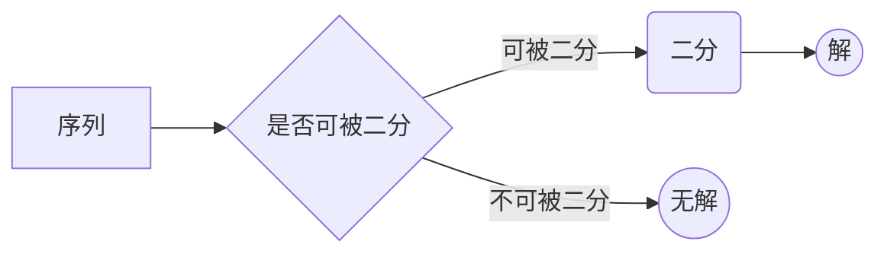
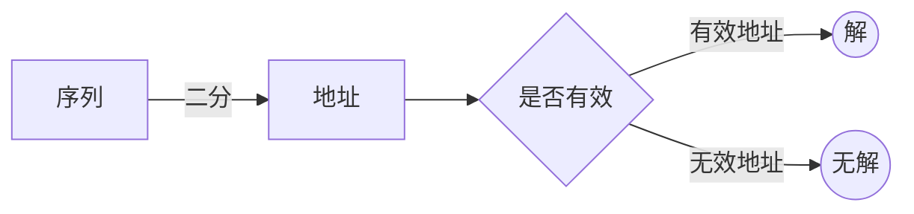

---
title:			基础算法杂谈
description:	'一些基础算法的大杂烩'

author: mooyyu
contrib:
category: [ algorithm ]
date: 2020-04-06
---

## 本文主要内容

-   二分
-   前缀和与差分
-   常用排序及其基本应用
-   位运算与二进制
-   字符串哈希

## 二分

### 引入：二分查找函数$$binary\_search$$

$$STL$$中的$$binary\_search(begin, end, value, comp = operator\!\!<)$$函数的功能简单来说是~~判断一个「单调」序列$$[l, r)$$中是否存在「值」为$$value$$的元素~~。但这样说是不严谨的，「单调」并不一定是指大小，相应地，「值」也并非一定是指数值，本质上来说，它们是针对于某种给定的性质而言的，而这性质由$$comp$$和$$value$$来共同描述。下面来详细分析一下这个函数。

**函数功能:**判断序列$$[l, r)$$中是否存在满足「$$comp$$和$$value$$描述的性质」的元素，也即检查「基于比较方法$$comp$$，等于$$value$$」的元素是否在序列$$[l, r)$$中。

-   「基于比较方法$$comp$$，等于$$value$$」:若$$comp(element, value) = false\mbox{ && }!comp(value, element) = true$$，则称$$element = value$$，即$$element$$满足「$$comp$$和$$value$$描述的性质」。

**函数执行成功的条件:**序列$$[l, r)$$对于$$comp$$和$$value$$共同描述的性质单调，即满足下列条件：

-   对于表达式$$comp(element, vale)$$，所有值为$$true$$的元素在值为$$false$$的元素的左边。
-   对于表达式$$!comp(value, element)$$，所有值为$$true$$的元素在值为$$false$$的元素的左边。
-   对于所有元素，若$$comp(element,value) = true$$，则$$!comp(value, element) = true$$。

可以注意到，整个分析过程中是没有数值比较(大小比较和相等判断都没有)的，有的只是性质(表达式)的满足与否，这便是二分的本质。

我们继续看看$$binary\_search$$是如何实现的：

```cpp
template<class ForwardIt, class T, class Compare>
bool binary_search(ForwardIt first, ForwardIt last, const T& value, Compare comp)
{
    first = std::lower_bound(first, last, value, comp);
    return (!(first == last) && !(comp(value, *first)));
}
```

可以看到其内部是由$$lower\_bound$$实现的，而$$lower\_bound$$其实才是二分的真正实现，$$binary\_search$$仅仅是套个壳，是二分的一种特殊化的应用。下面我们进一步看看二分到底实现了什么。

### 探究：二分的本质

二分是最基础的算法思想，这里我们讨论更为普通的二分算法。

对于一个给定的序列$$[l, r)$$，一个给定的对于该序列中元素的条件$$check()$$，若满足下面的性质，则该序列对于该条件可以被二分求解，且二分一定能得到解。$$\exists mid\in [l, r)$$，将该序列划分为两个子序列$$[l, mid),[mid, r)$$，满足下面两个条件之一
1. $$[l, mid)\not = \emptyset, \forall e\in [l, mid), check(e) = true, \forall u\in [mid, r), check(u) = false$$
2. $$[mid, r)\not = \emptyset, \forall e\in [mid, r), check(e) = true, \forall u\in [l, mid), check(u) = false$$

那么二分得到的解的意义就是「该序列中满足给定条件的临界元素」。

#### 二分的两种模型

在理论上二分的模型是统一的，但是在实际编码中，由于一个序列的两个子序列一定有位置之分（一般分为左右两个子序列），那么根据「左子序列中的元素满足条件」、「右子序列中的元素满足条件」可以分为左右两种模型。

##### 右二分模型

此模型对应的是「左子序列中的元素满足条件」。因为二分的解的意义在这个模型中特化为「左子序列中最右边的元素」。

```cpp
template< class type >
type rfind(const type l, const type r) {
	static type mid;
	if (l == r - 1) return l;
	mid = (l + r + 1) >> 1u;
	if (check(mid)) return rfind(mid, r);
	else return rfind(l, mid);
}
```

##### 左二分模型

此模型对应的是「右子序列中的元素满足条件」。因为二分的解的意义在这个模型中特化为「右子序列中最左边的元素」。

```cpp
template< class type >
type lfind(const type l, const type r) {
	static type mid;
	if (l == r - 1) return l;
	mid = (l + r - 1) >> 1u;
	if (check(mid)) return lfind(l, mid + 1);
	else return lfind(mid + 1, r);
}
```

##### 二分的编码细节

-   两个模型中分治时传递参数不同，是由其二分意义决定的。
-   在$$check(mid) = true$$这个分支中，需要保证子结构的范围一定小于本层范围，否则会造成死循环。
    -   $$rfind$$中要避免$$mid = l$$，则$$mid = (l + r + 1) \gg 1u$$。
    -   $$lfind$$中要避免$$mid + 1 = r$$，则$$mid = (l + r - 1)\gg 1u$$。

### 封装：上下界函数$$upper\_bound,\ lower\_bound$$

根据上面的分析，我们知道二分算法一定是可以得到解的，但一个序列不一定是可以二分的。求解问题的流程应该是：



但是对于一个封装好的函数，被调用是一定要执行的，那么无解的情况就以返回一个指向有效序列之外的地址代表，和$$STL$$的规范一致，无解时返回边界$$r$$。此时求解问题的流程就变为：



下面对比一下上下界函数和二分模型的区别与联系。


*注意上下界函数中$$comp$$的参数顺序不同。*

## 前缀和与差分

前缀和与差分都是一种预处理的手段，用于优化区间操作：前缀和优化区间求和的速度；差分优化区间更新（特指区间中素有元素加上一个数）的速度。

### 前缀和

```cpp
template< class type >
class prefix {
public:
	type ar[maxn + 1];
	void init(int n) {
		for (int i = 1; i <= n; i++)
			ar[i] += ar[i - 1];
	}
	type solve(int l, int r) { return ar[r] - ar[l - 1]; }
};
```

### 差分

差分其实就是前缀和的逆。

```cpp
template< class type >
class fidif {
public:
	type ar[maxn + 2];
	void init(int n) {
		for (int i = n; i >= 1; --i)
			ar[i] -= ar[i - 1];
	}
	void modify(int l, int r, type c) { ar[l] += c, ar[r + 1] -= c; }
};
```

### 多维前缀和与差分

-   **初始化**：先后分别对各个维度做一维的初始化。
-   **操作**：多维前缀和的区间求和与多维差分的区间更新都是对「容斥原理」的应用。

## 常用排序及其基本应用

这里说一说两个排序算法：快排和并归。它们都较好的运用了双指针思想，是应用比较多且思想比较好的排序算法。先来看看两个算法在几个方面的对比：

|          |                   快速排序                   |             并归排序             |
| -------: | :------------------------------------------: | :------------------------------: |
| 是否稳定 |                    不稳定                    |               稳定               |
|     流程 | 确定分界值，处理本层，得到分界点，分治子结构 | 确定分界点，分治子结构，处理本层 |
| 外部空间 |                    不需要                    |         需要一倍外部空间         |

可以发现快速排序是「自上而下」的排序，而并归是「自下而上」的，所以基本上所有和排序相关的附加操作都可以通过这两个算法的流程的实现。

### 快速排序

我们以将一个序列从小到大排序为例，解释一下快排的核心思想：**对于给定的一个序列$$[l, r)$$，若对于$$\forall mid\in [l + 1, r - 1)$$，都满足序列$$[l, mid)$$中的最大值不大于序列$$[mid, r)$$中的最小值，则可以确定序列$$[l, r)$$是从小到大排序完成的。**

而快排所做的事情就是：**对于一个给定的序列$$[l, r)$$，移动其中部分元素使得$$\exists mid\in [l + 1, r - 1)$$使得序列$$[l, mid)$$中的最大值不大于序列$$[mid, r)$$中的最小值，然后分治这两个子序列。**

```cpp
template< class type, class Comp >
void ksort(type *v, int l, int r, Comp cmp) {
	static int i, j;
	static type x;
	if (l >= r - 1) return ;
	i = l - 1, j = r;
	x = v[(l + r) >> 1u];
	while (i < j) {
		while (cmp(v[++i], x)) ;
		while (cmp(x, v[--j])) ;
		if (i < j) swap(v[i], v[j]);
	}
	ksort(v, l, i, cmp);
	ksort(v, i, r, cmp);
}
```

可以注意到$$i, j$$是等价的，都可以作为序列的划分点。实现细节上略需注意：

-   一般区间中待比较的元素$$x$$有这几种选法：最左/右边的元素，中间元素，随机元素。对于随机数据，它们的平均时间复杂度是一样的，但若初始序列为完全相反的排序状态，则选用最左/右边的元素将达到最坏时间复杂度。对于中间元素和随机元素，一般选用实现较为简单的中间元素。
-   以$$i$$作为划分点时，$$x$$不能取用当前区间最左边元素，否则将有可能造成死循环。一般实现为$$x = v[(l+r)\gg 1u]$$。
-   同理，$$j$$作为划分点时，$$x = v[(l+r-1)\gg 1u]$$。
-   $$Comp$$可以为$$less, greater$$。

#### 查找第k小/大的数

若划分点所在位置元素的值与待比较元素$$x$$的值相等，则划分点所在位置的元素在排序完成的整个序列中位置已经确定为该位置。下面以$$i$$为划分点为例：

```cpp
if (v[i] == x && i == k) return x;
if (k < i) return seek(v, l, i, k, cmp);
else return seek(v, i, r, k, cmp);
```

### 并归排序

并归排序的核心思想较为容易理解：**对于一个给定的序列$$[l, r)$$，通过中间点$$mid$$将其划分为$$[l, mid), [mid, r)$$两个子序列并分治使子序列排序完成，然后合并它们。**

```cpp
template< class type, class Comp >
void msort(type *v, int l, int r, Comp cmp) {
	static type bak[maxn];
	static int i, j, pos;
	if (l >= r - 1) return ;
	const int mid = (l + r) >> 1u;
	msort(v, l, mid, cmp);
	msort(v, mid, r, cmp);
	i = l, j = mid, pos = l;
	while (i < mid && j < r) {
		if (cmp(v[i], v[j])) bak[pos++] = v[i++];
		else bak[pos++] = v[j++];
	}
	while (i < mid) bak[pos++] = v[i++];
	while (j < r) bak[pos++] = v[j++];
	while (--pos >= l) v[pos] = bak[pos];
}
```

需要注意：

-   由于并归排序的分治在本层操作之前，所以$$mid$$的类型一定不能是$$static$$。
-   $$Comp$$可以为$$less\_equal, greater\_equal$$。

#### 计算正/逆序对

对于一个给定的序列$$[l, r)$$，可以把其中的有序数对$$\{e, u\}$$分为3种：

-   $$e, u\in [l, mid)$$，这部分正/逆序对由分治$$[l, mid)$$时求得。
-   $$e, u\in [mid, r)$$，这部分正/逆序对由分治$$[mid, r)$$时求得。
-   $$e\in [l, mid), u\in [mid, r)$$，这部分由本层并归时求得。

显然第3种情况是需要处理的重点，我们以分析从小到大排序的正/逆序对的计算为例：


- 若$$v[i]\leqslant v[j]$$，又$$v[j]\leqslant v[j+1]\leqslant \cdots\leqslant v[r-1]$$，所以有$$\forall x\in [j, r)$$满足$$v[i]\leqslant v[x]$$，共确定了$$r - j$$个正序对。
- 若$$v[i] > v[j]$$，又$$v[i]\leqslant v[i+1]\leqslant\cdots\leqslant v[mid-1]$$，所以有$$\forall x\in [i, mid)$$满足$$v[x] > v[j]$$，共确定了$$mid-i$$个逆序对。


## 位运算与二进制

### 快速枚举组合

```cpp
for (int i = 0, k = 1 << n; i < k; i++)
    for (int j = 0; j < n; j++)
        if (i >> j & 1u)
            ...
```

### 快速幂与龟速乘

快速幂是将$$O(n)$$的乘方通过$$O(\log n)$$的乘法实现；龟速乘是将$$O(1)$$的乘法通过$$O(\log n)$$的加法实现。龟速乘虽然慢，但是对于大数相乘别无他法。

#### 快速幂

```cpp
llong qpow(llong x, llong a, llong mod) {
	static llong ret;
	ret = 1;
	while (a) {
		if (a & 1u) (ret *= x) %= mod;
		(x *= x) %= mod;
		a >>= 1u;
	}
	return ret;
}
```

#### 龟速乘

```cpp
ullong smul(ullong a, ullong b, ullong mod) {
	static ullong ret;
    ret = 0;
	while (b) {
		if (b & 1u) (ret += a) %= mod;
		(a <<= 1u) %= mod;
		b >>= 1u;
	}
	return ret;
}
```

## 字符串哈希

这里介绍一种常用且很著名的字符串哈希方法——**BKHDHash**。这种哈希方法是将字符串理解为一个$$p$$进制的数。由于我们需要区间哈希，所以要借助前缀和的思想。根据经验，$$p$$取值为131或1331，字符的值映射为对应的ASCII码值，区间哈希值对$$2^{64}$$取模时冲突率极小。直接使用$$unsigned\ long\ long$$类型存储，溢出即取模。

```cpp
class strhash {
	string s;
	ullong ar[maxn + 1] {};
	ullong bin[maxn+1] {1ULL};
	const ullong base = 131ULL;
public:
	explicit string_hash(string &str):s(move(str)) {
		for (int i = 0; i < s.length(); i++) {
			ar[i + 1] = ar[i] * base + s[i];
			bin[i+1] = bin[i] * base;
		}
	}
	ullong hash(const int l, const int r) {
		return ar[r] - ar[l] * bin[r - l];
	}
};
```

